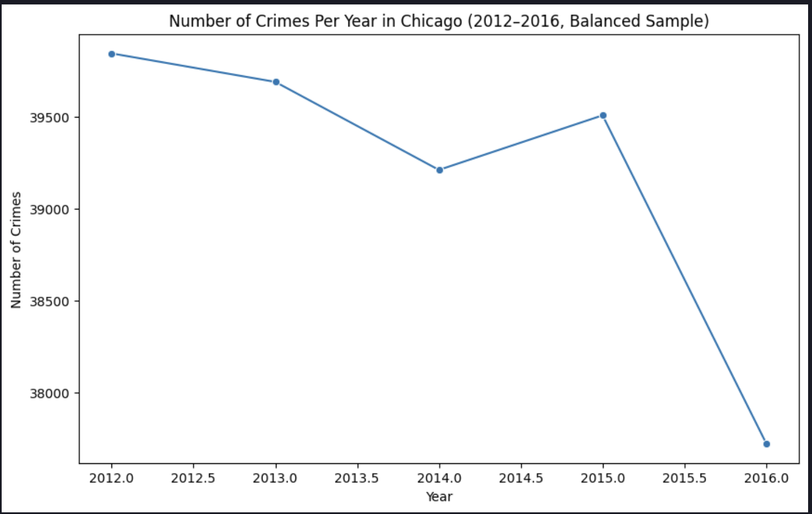
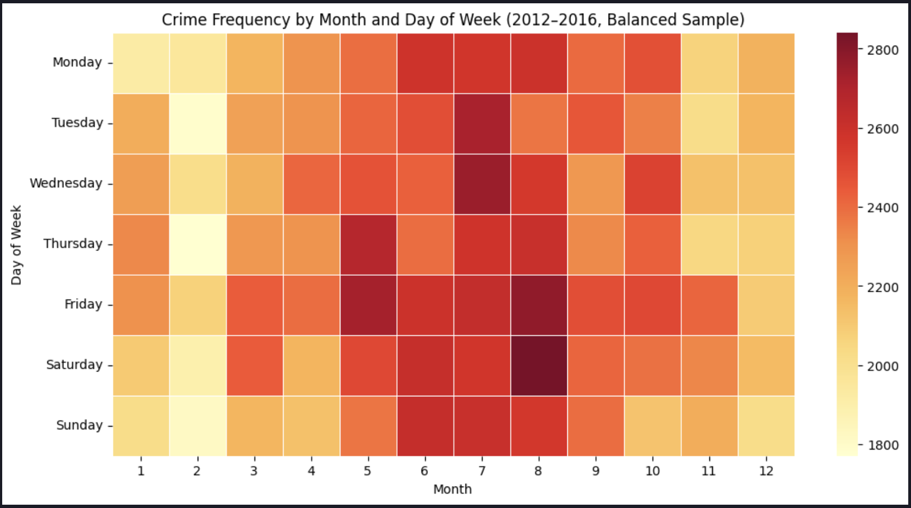
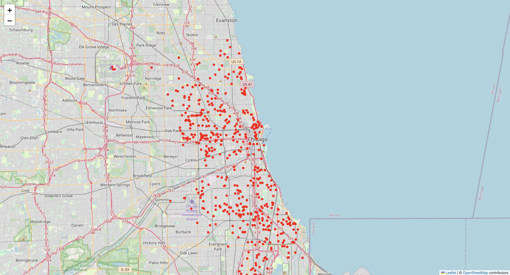

# Chicago Crime Data Visualization  

This project explores Chicago crime data (2001–2017) through data cleaning, analysis, and multiple visualizations. It demonstrates the use of Python for data wrangling, statistical visualization, and geospatial analysis.  

The goal is to uncover patterns and trends in Chicago crime while showcasing data science skills for portfolio and academic purposes.  

## 📥 Dataset
The raw Chicago crime datasets (2001–2017) are too large to host in this repo.  
You can download them directly from the [Chicago Data Portal](https://data.cityofchicago.org/Public-Safety/Crimes-2001-to-Present/ijzp-q8t2).

## 📊 Visualizations  

### 1. Crimes Per Year (2012–2016)  
Line chart showing yearly crime trends after data cleaning and balancing.  

  

### 2. Top 10 Most Common Crime Types  
Bar chart showing the most frequent crime types in Chicago.  

 

### 3. Crime Frequency by Month & Day of Week  
Heatmap of crime distribution across months and days of the week.  

 

### 4. Interactive Crime Map 🌍  
This is an interactive map built with Folium, plotting thousands of crime events across Chicago. Below is a preview:  

  

Explore the full interactive version by opening [`chicago_crime_map.html`](chicago_crime_map.html) in your browser.  

## ⚙️ Tech Stack  
- Python  
- Pandas (data cleaning & analysis)  
- Matplotlib & Seaborn (statistical visualization)  
- Folium (geospatial interactive map)  
- Jupyter Notebook / VS Code (development environment)  

## 📂 Project Structure  
Below I show what is in my folder "data-visualization"

data-visualization/
│── .ipynb_checkpoints/                # Jupyter notebook checkpoints
│── .vscode/                           # VS Code settings
│── venv/                              # Virtual environment
│── chicago_crime_map.html             # Interactive map (open in browser)
│── Chicago_Crimes_2001_to_2004.csv    # Raw data (2001–2004)
│── Chicago_Crimes_2005_to_2007.csv    # Raw data (2005–2007)
│── Chicago_Crimes_2008_to_2011.csv    # Raw data (2008–2011)
│── Chicago_Crimes_2012_to_2017.csv    # Raw data (2012–2017)
│── crime_analysis.ipynb               # Main analysis notebook
│── crime_heatmap.png                  # Screenshot of heatmap
│── crime_map.png                      # Screenshot of map for README
│── crimes_per_year.png                # Screenshot of line chart
│── top_crimes.png                     # Screenshot of bar chart
│── README.md                          # Project documentation
│── requirements.txt                   # Minimal dependencies for the project.
│── requirements_full.txt              # Full environment freeze for exact replication.

